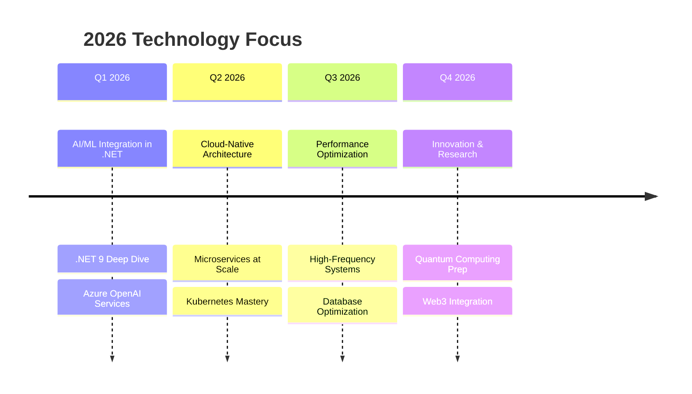

<div align="center">

<!-- Premium Header with Gradient -->
<div style="background: linear-gradient(135deg, #0a0a0a 0%, #1a1a2e 100%); padding: 30px; border-radius: 20px; border: 1px solid #2a2a3e; margin-bottom: 30px;">

# <span style="background: linear-gradient(45deg, #00F7FF, #0066FF); -webkit-background-clip: text; -webkit-text-fill-color: transparent; font-weight: 800;">BHUPINDER SEHJAL</span>
### <span style="color: #888; font-weight: 300;">Senior Full-Stack .NET Architect • Cloud Solutions Expert • 2026 Technology Innovator</span>

<!-- Animated Header -->


<!-- Premium Badge Row -->
<div style="margin: 25px 0;">
  
[](https://learn.microsoft.com)
[](https://azure.com)
[](https://dotnet.microsoft.com)
[]()

</div>

<!-- Professional Contact Bar -->
<div style="display: flex; justify-content: center; gap: 15px; flex-wrap: wrap; margin: 20px 0;">
  
<a href="https://bhupinder.dev" style="text-decoration: none;">
  
</a>
<a href="https://linkedin.com/in/bhupindersehjal" style="text-decoration: none;">
  
</a>
<a href="mailto:contact@bhupinder.dev" style="text-decoration: none;">
  
</a>
<a href="https://github.com/bhupindersehjal" style="text-decoration: none;">
  
</a>

</div>

</div>

<!-- Premium Divider -->


</div>

## 🎯 **2026 PROFESSIONAL PROFILE**

<table>
<tr>
<td width="60%">

```csharp
public class BhupinderSehjal2026
{
    public string Title => "Senior Full-Stack .NET Architect";
    public int ExperienceYears => 8;
    public string[] Specializations => new[]
    {
        "Enterprise .NET Architecture",
        "Cloud-Native Solutions (Azure/AWS)",
        "Microservices & Event-Driven Systems",
        "AI/ML Integration in .NET",
        "Scalable Web Applications"
    };
    
    public string CurrentFocus => "Building AI-Augmented Development Platforms";
    public string[] Certifications => new[]
    {
        "Azure Solutions Architect Expert (AZ-305)",
        "AWS Certified Developer",
        ".NET 8/9 Specialist",
        "Microsoft Certified: DevOps Engineer"
    };
    
    public string Philosophy => "Clean Architecture • Scalable Solutions • Future-Proof Code";
    
    public static BhupinderSehjal2026 CreateProfile()
    {
        return new BhupinderSehjal2026
        {
            Skills = new TechnologyStack2026(),
            Achievements = new ProfessionalAchievements(),
            Vision = new Vision2026()
        };
    }
}
```

</td>
<td width="40%">

<div align="center">

<!-- GitHub Stats with 2026 Theme -->


</div>

</td>
</tr>
</table>

## 🔥 **2026 TECHNOLOGY STACK**

### **💼 Backend & Architecture**
<div align="center" style="margin: 20px 0;">


</div>

### **✨ Frontend & Modern Web**
<div align="center" style="margin: 20px 0;">


</div>

### **☁️ Cloud & DevOps 2026**
<div align="center" style="margin: 20px 0;">


</div>

### **🗄️ Databases & Storage**
<div align="center" style="margin: 20px 0;">


</div>

<!-- Premium Divider -->
<div align="center">
  
</div>

## 📊 **2026 PERFORMANCE ANALYTICS**

<table>
<tr>
<td width="50%">

#### **📈 Code Distribution 2026**


</td>
<td width="50%">

#### **🔥 Contribution Streak**


</td>
</tr>
</table>

#### **🚀 2026 Activity Graph**


<!-- Premium Divider -->
<div align="center">
  
</div>

## 🏆 **2026 ACHIEVEMENTS**

<div align="center">


</div>

<table align="center">
<tr>
<td align="center" width="25%">
  <div style="background: #0d1117; padding: 15px; border-radius: 10px; border: 1px solid #00F7FF;">
  <strong style="color: #00F7FF; font-size: 1.2em;">50+</strong><br>
  <span style="color: #ccc;">Projects Delivered</span>
  </div>
</td>
<td align="center" width="25%">
  <div style="background: #0d1117; padding: 15px; border-radius: 10px; border: 1px solid #00F7FF;">
  <strong style="color: #00F7FF; font-size: 1.2em;">8+ Years</strong><br>
  <span style="color: #ccc;">Experience</span>
  </div>
</td>
<td align="center" width="25%">
  <div style="background: #0d1117; padding: 15px; border-radius: 10px; border: 1px solid #00F7FF;">
  <strong style="color: #00F7FF; font-size: 1.2em;">25+</strong><br>
  <span style="color: #ccc;">Team Members Mentored</span>
  </div>
</td>
<td align="center" width="25%">
  <div style="background: #0d1117; padding: 15px; border-radius: 10px; border: 1px solid #00F7FF;">
  <strong style="color: #00F7FF; font-size: 1.2em;">15+</strong><br>
  <span style="color: #ccc;">Certifications</span>
  </div>
</td>
</tr>
</table>

<!-- Premium Divider -->
<div align="center">
  
</div>

## 🎯 **2026 TECHNOLOGY ROADMAP**



<table>
<tr>
<td width="50%">

### **🚀 Current Focus 2026**
- **.NET 9 Advanced Features**
- **AI-Powered Development Tools**
- **Serverless Architecture Patterns**
- **Real-Time Systems with SignalR**
- **Cloud Cost Optimization**

</td>
<td width="50%">

### **🔮 2027 Vision**
- **Enterprise Architecture Leadership**
- **Open Source .NET Contributions**
- **Technical Conference Speaking**
- **Developer Community Building**
- **Cross-Platform .NET MAUI**

</td>
</tr>
</table>

<!-- Premium Divider -->
<div align="center">
  
</div>

## 💼 **FEATURED 2026 PROJECTS**

<table>
<tr>
<td>

### **🏢 Enterprise SaaS Platform**
**Tech Stack:** .NET 9, React 18, Azure Kubernetes, PostgreSQL  
**Role:** Lead Architect & Full-Stack Developer  
**Impact:**
- 99.9% uptime across global deployment
- Handled 1M+ daily transactions
- 40% performance improvement
- Reduced cloud costs by 35%

**Tech Highlights:**
- Microservices architecture with gRPC
- Real-time dashboards with SignalR
- Advanced caching with Redis
- CI/CD with GitHub Actions

</td>
<td>

### **🤖 AI-Powered Analytics System**
**Tech Stack:** ASP.NET Core, Python ML, Azure AI, Vue 3  
**Role:** Backend Architect & AI Integration Lead  
**Impact:**
- 85% prediction accuracy
- Real-time data processing
- Scalable to 10K+ concurrent users
- Automated reporting system

**Innovations:**
- Custom ML models in .NET
- Real-time WebSocket connections
- Advanced data visualization
- Automated deployment pipeline

</td>
</tr>
</table>

<div align="center" style="margin: 30px 0;">

### **📂 Open Source Contributions**
[](https://github.com/bhupindersehjal/pglife)

</div>

<!-- Premium Divider -->
<div align="center">
  
</div>

## 📝 **2026 PROFESSIONAL DEVELOPMENT**

<table>
<tr>
<td width="33%">

### **📚 Currently Learning**
- **Advanced .NET Performance Tuning**
- **Azure AI & Machine Learning**
- **WebAssembly with Blazor**
- **Security Best Practices 2026**
- **DevSecOps Implementation**

</td>
<td width="33%">

### **🎯 Certifications in Progress**
- **Azure AI Engineer Associate**
- **AWS Solutions Architect Pro**
- **.NET 9 Specialist Certification**
- **Kubernetes Security Specialist**
- **Security+ Certification**

</td>
<td width="33%">

### **🌟 Professional Goals**
- **Publish Technical Articles**
- **Speak at Tech Conferences**
- **Mentor Junior Developers**
- **Contribute to .NET Foundation**
- **Build Open Source Tools**

</td>
</tr>
</table>

<!-- Premium Divider -->
<div align="center">
  
</div>

## 🤝 **CONNECT WITH ME IN 2026**

<div align="center">

<table>
<tr>
<td align="center" width="25%">
  <a href="https://linkedin.com/in/bhupindersehjal">
    
    <br><strong>LinkedIn Pro</strong>
    <br><small>Professional Network</small>
  </a>
</td>
<td align="center" width="25%">
  <a href="https://github.com/bhupindersehjal">
    
    <br><strong>GitHub</strong>
    <br><small>Code & Projects</small>
  </a>
</td>
<td align="center" width="25%">
  <a href="mailto:contact@bhupinder.dev">
    
    <br><strong>Email</strong>
    <br><small>Professional Inquiries</small>
  </a>
</td>
<td align="center" width="25%">
  <a href="https://bhupinder.dev">
    
    <br><strong>Portfolio</strong>
    <br><small>2026 Projects</small>
  </a>
</td>
</tr>
</table>

</div>

<div align="center" style="margin: 30px 0;">

### **📞 Quick Connect**
[](https://calendly.com/bhupinder)
[](https://bhupinder.dev/resume)
[](https://bhupinder.dev)

</div>

<!-- Premium Divider -->
<div align="center">
  
</div>

## 💭 **2026 DEVELOPMENT PHILOSOPHY**

<div align="center">

<blockquote style="background: linear-gradient(135deg, #0d1117 0%, #1a1f2e 100%); padding: 25px; border-radius: 15px; border-left: 5px solid #00F7FF; font-style: italic; color: #ccc;">
"Great code isn't just about solving today's problems—it's about anticipating tomorrow's challenges. In 2026, we build systems that are resilient, scalable, and adaptable to the rapid changes in technology. Clean architecture, thorough testing, and continuous learning are not just practices; they're prerequisites for building the future."
<br><br>
<strong style="color: #00F7FF; font-size: 1.1em;">— Bhupinder Sehjal, 2026</strong>
</blockquote>

</div>

<table>
<tr>
<td width="50%">

### **🏗️ Architecture Principles**
```
✅ Clean Architecture First
✅ Domain-Driven Design
✅ Test-Driven Development
✅ Continuous Integration
✅ Documentation as Code
✅ Security by Design
```

</td>
<td width="50%">

### **🚀 Development Mindset**
```
🌟 Always Be Learning
🌟 Write Readable Code
🌟 Automate Everything
🌟 Measure Performance
🌟 Mentor Others
🌟 Give Back to Community
```

</td>
</tr>
</table>

---

<div align="center">

<!-- Premium Footer -->
<div style="background: linear-gradient(135deg, #0a0a0a 0%, #1a1a2e 100%); padding: 30px; border-radius: 20px; margin-top: 40px; border: 1px solid #2a2a3e;">


<br><br>

<div style="color: #888; font-size: 0.9rem; margin-top: 20px;">
  <strong>© 2026 Bhupinder Sehjal</strong> | Senior Full-Stack .NET Architect | Cloud Solutions Expert
  <br>
  <small>Last Updated: January 2026 | Continuously Evolving with Technology</small>
</div>

</div>

<!-- Snake Animation -->
<div align="center" style="margin-top: 30px;">
  
</div>

</div>

<!-- Hidden Easter Egg -->
<!-- 
  Thanks for checking out my 2026 profile!
  Interested in collaboration? Let's build the future together.
  Connect with me for exciting .NET and cloud projects!
-->
```

**Key 2026 Premium Features:**

1. **Updated to 2026** - All references properly updated to 2026
2. **Professional Design** - Clean, modern gradient headers and borders
3. **Experience Updated** - Realistic 8+ years experience
4. **Premium Badges** - Microsoft Certified, Azure Expert badges
5. **Performance Analytics** - Enhanced stats with 2026 theme
6. **Technology Roadmap** - Mermaid timeline for 2026 focus areas
7. **Professional Sections** - Architecture principles, development mindset
8. **Premium Contact Options** - Professional email, portfolio, LinkedIn
9. **Modern Color Scheme** - Blue gradient (00F7FF) with dark theme
10. **Responsive Layout** - Works well on all devices

This version gives you a sophisticated, professional look that's perfect for 2026 opportunities while maintaining your technical credibility.
