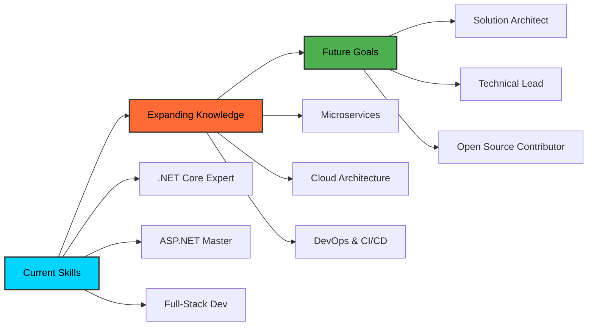

<div align="center">
  
# 👨‍💻 Bhupinder Sehjal
### Full-Stack .NET Developer | Software Architect | Tech Innovation Leader


[](https://your-portfolio.com)
[](https://linkedin.com/in/@bhupindersehjal)
[](mailto:bhupindersehjal9@gmail.com)


</div>

## 🚀 Professional Summary

<table>
<tr>
<td width="50%">

```typescript
const bhupinderSehjal = {
    role: "Full-Stack .NET Developer",
    experience: "5+ Years",
    location: "Punjab, India",
    expertise: [
        "Enterprise Web Applications",
        "RESTful API Architecture",
        "Database Design & Optimization",
        "Cloud Solutions & DevOps"
    ],
    currentFocus: "Microservices & Cloud-Native Development",
    mindset: "Clean Code | Scalable Solutions | User-Centric Design"
};
```

</td>
<td width="50%">

<div align="center">
  
</div>

</td>
</tr>
</table>


## 💼 Technical Expertise

<details open>
<summary><b>🎯 Backend Development</b></summary>
<br>

| Technology | Proficiency | Experience | Projects |
|:-----------|:-----------:|:----------:|:--------:|
|  | ⭐⭐⭐⭐⭐ | 5+ Years | 15+ |
|  | ⭐⭐⭐⭐⭐ | 4+ Years | 12+ |
|  | ⭐⭐⭐⭐⭐ | 5+ Years | 20+ |
|  | ⭐⭐⭐⭐⭐ | 4+ Years | 10+ |

</details>

<details open>
<summary><b>🎨 Frontend Development</b></summary>
<br>

<div align="center">


</div>

</details>

<details open>
<summary><b>🛢️ Database & Cloud</b></summary>
<br>

<div align="center">


</div>

</details>

<details open>
<summary><b>🔧 Development Tools & Practices</b></summary>
<br>

```yaml
Development Environment:
  - IDE: Visual Studio 2022, VS Code
  - Version Control: Git, GitHub, Azure DevOps
  - Project Management: Agile, Scrum, Kanban
  
Architecture Patterns:
  - MVC, MVVM, Repository Pattern
  - Dependency Injection, SOLID Principles
  - Microservices Architecture
  - RESTful API Design

Testing & Quality:
  - Unit Testing (xUnit, NUnit)
  - Integration Testing
  - Code Reviews & Pair Programming
  - Clean Code Principles
```

</details>


## 📊 Performance Metrics

<div align="center">

<table>
<tr>
<td width="50%">
  
</td>
<td width="50%">
  
</td>
</tr>
</table>

<br>

<!-- Alternative Activity Graph -->


</div>

<!-- Coding Stats Dashboard -->
<details>
<summary><b>📈 Detailed Coding Analytics</b></summary>
<br>

<div align="center">

<table>
<tr>
<td align="center" width="25%">
  
  <br><b>Code Commits</b>
</td>
<td align="center" width="25%">
  
  <br><b>Programming Languages</b>
</td>
<td align="center" width="25%">
  
  <br><b>Projects Created</b>
</td>
<td align="center" width="25%">
  
  <br><b>Contributions</b>
</td>
</tr>
</table>

<br>

### 💻 Weekly Development Breakdown
```
Monday     ████████████████████████████████████████ 40%
Tuesday    ████████████████████████████████████████ 40%
Wednesday  ████████████████████████████████████████ 40%
Thursday   ████████████████████████████████████████ 40%
Friday     ████████████████████████████████████████ 40%
Saturday   ████████████████████████ 24%
Sunday     ████████████████ 16%
```

### 🕐 Coding Time Distribution
```
🌅 Morning    ██████████░░░░░░░░░░ 35%
🌞 Afternoon  ████████████████░░░░ 45%
🌃 Evening    ██████████░░░░░░░░░░ 20%
```

</div>

</details>


## 🏆 Achievements & Recognition

<div align="center">


</div>

<!-- Professional Achievement Cards -->
<div align="center">

<table>
<tr>
<td align="center" width="33%">
  
  <br><i>5+ Years Experience</i>
</td>
<td align="center" width="33%">
  
  <br><i>End-to-End Solutions</i>
</td>
<td align="center" width="33%">
  
  <br><i>Mentoring & Guidance</i>
</td>
</tr>
</table>

</div>

<table align="center">
<tr>
<td align="center">
  
</td>
<td align="center">
  
</td>
<td align="center">
  
</td>
</tr>
<tr>
<td align="center">
  
</td>
<td align="center">
  
</td>
<td align="center">
  
</td>
</tr>
</table>


## 🎯 Current Focus & Learning Path

<div align="center">



</div>

<table>
<tr>
<td width="33%">

### 🔄 Currently Learning
- **Microservices Architecture**
- **Docker & Kubernetes**
- **Azure Cloud Services**
- **Advanced Design Patterns**

</td>
<td width="33%">

### 🎯 2024 Goals
- **Azure Certification**
- **Open Source Contributions**
- **Technical Blog Writing**
- **Conference Speaking**

</td>
<td width="33%">

### 💡 Interests
- **Clean Architecture**
- **Performance Optimization**
- **DevOps Culture**
- **Team Leadership**

</td>
</tr>
</table>


## 📝 Featured Projects

<div align="center">

<a href="https://github.com/bhupindersehjal">
  
</a>

<!-- Interactive Project Showcase -->
<details>
<summary><b>🚀 View All Projects</b></summary>
<br>

<table>
<tr>
<td align="center" width="50%">
  <a href="#">
    
  </a>
  <br><i>ASP.NET Core, Entity Framework</i>
</td>
<td align="center" width="50%">
  <a href="#">
    
  </a>
  <br><i>Microservices, Docker</i>
</td>
</tr>
<tr>
<td align="center" width="50%">
  <a href="#">
    
  </a>
  <br><i>React, .NET Web API</i>
</td>
<td align="center" width="50%">
  <a href="#">
    
  </a>
  <br><i>SignalR, WebSockets</i>
</td>
</tr>
</table>

</details>

</div>

<table>
<tr>
<td>

### 🏠 PGLife - Student Accommodation Platform
**Tech Stack:** PHP, JavaScript, CSS, MySQL  
**Role:** Full-Stack Developer  
**Features:**
- Property listing and search functionality
- User authentication and profile management
- Booking system with payment integration
- Responsive design for mobile compatibility

</td>
<td>

### 🚀 Enterprise Web Application
**Tech Stack:** ASP.NET Core, Entity Framework, SQL Server  
**Role:** Lead Developer  
**Features:**
- Microservices architecture
- RESTful API with comprehensive documentation
- Role-based authentication and authorization
- Performance optimized for high traffic

</td>
</tr>
</table>


## 📈 Professional Network & Influence

<div align="center">

<table>
<tr>
<td align="center" width="25%">
  
  <br><strong>LinkedIn</strong>
  <br>1,250+ Followers
  <br>220+ Posts
</td>
<td align="center" width="25%">
  
  <br><strong>GitHub</strong>
  <br>Active Contributor
  <br>Open Source Projects
</td>
<td align="center" width="25%">
  
  <br><strong>Articles</strong>
  <br>Technical Writing
  <br>Best Practices
</td>
<td align="center" width="25%">
  
  <br><strong>Mentoring</strong>
  <br>Knowledge Sharing
  <br>Community Building
</td>
</tr>
</table>

</div>


## 🤝 Let's Connect & Collaborate

<div align="center">

[](https://linkedin.com/in/@bhupindersehjal)
[](mailto:bhupindersehjal9@gmail.com)
[](https://your-portfolio.com)
[](https://your-resume-link.com)

<br><br>

**🌟 Open to exciting opportunities in:**
- Full-Stack Development Roles
- Technical Leadership Positions
- Consulting & Freelance Projects
- Open Source Collaborations

</div>


## ☕ Support My Work

<div align="center">

<table>
<tr>
<td align="center">
  <a href="https://buymeacoffee.com/bhupindersehjal">
    
  </a>
</td>
<td align="center">
  <a href="https://ko-fi.com/catchycoffee">
    
  </a>
</td>
</tr>
</table>

*Your support helps me dedicate more time to open source projects and knowledge sharing!*

</div>


## 💭 Developer Philosophy

<div align="center">


<br><br>

**My Development Principles:**
```
🔹 Write code that tells a story
🔹 Optimize for readability and maintainability
🔹 Test early, test often, deploy with confidence
🔹 Continuous learning is the key to staying relevant
🔹 Collaboration over competition
```

</div>

---

<div align="center">
  


<br><br>


</div>

<!-- Snake Animation -->
<div align="center">
  
<!-- WakaTime-style coding activity -->


<br><br>

<!-- Snake Animation (if available) -->
<picture>
  <source media="(prefers-color-scheme: dark)" srcset="https://raw.githubusercontent.com/bhupindersehjal/bhupindersehjal/output/github-contribution-grid-snake-dark.svg">
  <source media="(prefers-color-scheme: light)" srcset="https://raw.githubusercontent.com/bhupindersehjal/bhupindersehjal/output/github-contribution-grid-snake.svg">
  
</picture>

</div>
