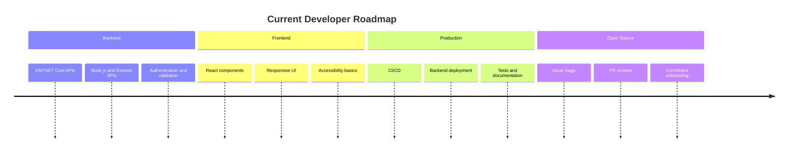

<div align="center">

# Bhupinder Sehjal

### Full-Stack Developer | ASP.NET Core | React | APIs | Open Source

I build practical web applications, improve backend architecture, and create beginner-friendly open-source projects where contributors can learn by doing.

[](https://www.linkedin.com/in/bhupinder-sehjal-38290a1a9)
[](https://github.com/BhupinderSehjal)
[](https://github.com/BhupinderSehjal/OpenLife)


</div>

---

## About Me

I am focused on building real projects with clean APIs, useful documentation, and maintainable code. My current work is centered around **OpenLife**, an open-source productivity and workflow reflection platform.

```csharp
public sealed class BhupinderSehjal
{
    public string Role => "Full-Stack Developer";
    public string[] Focus => ["ASP.NET Core", "React", "REST APIs", "Open Source"];
    public string CurrentProject => "OpenLife";
    public string Goal => "Build useful software and help new contributors learn by contributing.";
}
```

---

## Current Focus

| Area | What I am working on |
| --- | --- |
| Open source | Maintaining and growing OpenLife |
| Backend | ASP.NET Core, Node.js, Express, API design |
| Frontend | React, Vite, Tailwind CSS |
| Database | MongoDB, Mongoose, SQL Server basics |
| Dev workflow | GitHub Actions, issues, PR reviews, CI/CD |
| Learning | Production-ready APIs, deployment, testing, maintainership |

---

## Featured Project: OpenLife

OpenLife is an open-source productivity, time tracking, habit reflection, and workflow analysis platform.

<table>
<tr>
<td width="50%">

### What OpenLife Includes

- React + Vite frontend
- Node.js + Express backend
- ASP.NET Core backend starter
- MongoDB/Mongoose API work
- GitHub Actions CI
- Issue templates and PR templates
- Contributor onboarding
- Roadmap and backend readiness docs

</td>
<td width="50%">

### Links

- [Repository](https://github.com/BhupinderSehjal/OpenLife)
- [Live frontend](https://openlife-nine.vercel.app)
- [Good first issues](https://github.com/BhupinderSehjal/OpenLife/labels/good%20first%20issue)
- [Roadmap](https://github.com/BhupinderSehjal/OpenLife/blob/main/ROADMAP.md)
- [Backend readiness](https://github.com/BhupinderSehjal/OpenLife/blob/main/BACKEND_READINESS.md)

</td>
</tr>
</table>

[](https://github.com/BhupinderSehjal/OpenLife)

---

## Tech Stack

<details open>
<summary><strong>Backend</strong></summary>

<br>


</details>

<details open>
<summary><strong>Frontend</strong></summary>

<br>


</details>

<details>
<summary><strong>Database, Tools, and Workflow</strong></summary>

<br>


</details>

---

## Interactive Project Map

<details open>
<summary><strong>OpenLife Maintainer Work</strong></summary>

<br>

| Workstream | Status |
| --- | --- |
| Professional README | Done |
| Contributor onboarding | Done |
| Good first issues | Done |
| Backend readiness guide | Done |
| Node backend hardening | In progress |
| ASP.NET Core backend starter | Done |
| Backend deployment | Planned |
| Screenshots and social preview | Planned |

</details>

<details>
<summary><strong>What I want contributors to help with</strong></summary>

<br>

- Add helpful frontend empty states.
- Improve accessibility labels and focus states.
- Add backend tests.
- Improve API examples.
- Deploy the backend.
- Extend the ASP.NET Core backend.
- Add screenshots and product docs.

</details>

<details>
<summary><strong>How I review good pull requests</strong></summary>

<br>

I prefer pull requests that are:

- Small and focused.
- Linked to an issue.
- Easy to test.
- Clear about what changed and why.
- Respectful of the existing project structure.

</details>

---

## GitHub Stats

<div align="center">


</div>

---

## Learning Roadmap


```mermaid
timeline
    title Current Developer Roadmap
    section Backend
      ASP.NET Core APIs
      Node.js and Express APIs
      Authentication and validation
    section Frontend
      React components
      Responsive UI
      Accessibility basics
    section Production
      CI/CD
      Backend deployment
      Tests and documentation
    section Open Source
      Issue triage
      PR reviews
      Contributor onboarding
```

---

## Open Source Goals

- Make OpenLife production-ready step by step.
- Help new contributors make their first useful pull request.
- Add backend deployment, tests, and API documentation.
- Keep issues clear, scoped, and beginner-friendly.
- Build practical projects around productivity, learning, and developer workflows.

---

## Connect

- LinkedIn: [Bhupinder Sehjal](https://www.linkedin.com/in/bhupinder-sehjal-38290a1a9)
- GitHub: [BhupinderSehjal](https://github.com/BhupinderSehjal)

<div align="center">

**Building OpenLife in public and learning by shipping.**

</div>
